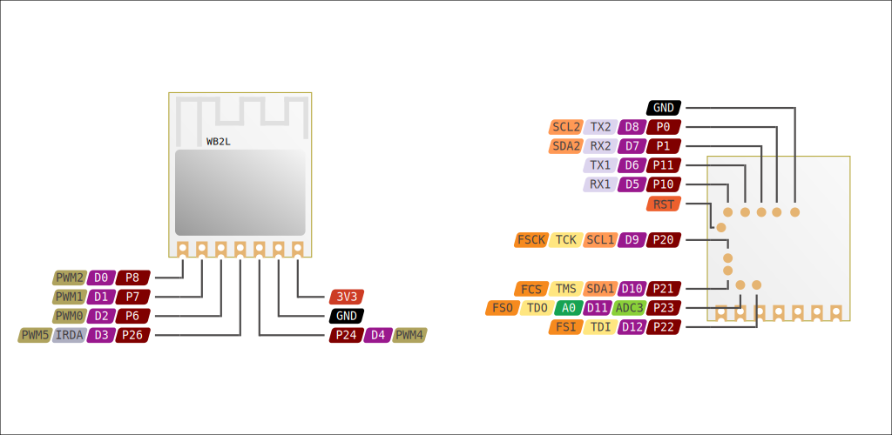

# WB2L Wi-Fi Module

*by Tuya Inc.*

[Product page](https://developer.tuya.com/en/docs/iot/wb2l-datasheet?id=K9duegc9bualu)

- [General info](../../docs/platform/beken-72xx/README.md)
- [Flashing (Tuya manual)](https://developer.tuya.com/en/docs/iot/burn-and-authorize-wb-series-modules?id=Ka78f4pttsytd)
- [BkWriter v1.6.0](https://images.tuyacn.com/smart/bk_writer1.60/bk_writer1.60.exe)

Parameter    | Value
-------------|----------------------------------
MCU          | BK7231T
Manufacturer | Beken
Series       | BK72XX
Frequency    | 120 MHz
Flash size   | 2 MiB
RAM size     | 256 KiB
Voltage      | 3.0V - 3.6V
I/O          | 13x GPIO, 5x PWM, 2x UART, 1x ADC
Wi-Fi        | 802.11 b/g/n
Bluetooth    | BLE v4.2

## Pinout

## Arduino Core pin mapping

No. | Pin       | UART     | I²C      | SPI | PWM  | Other
----|-----------|----------|----------|-----|------|------
D0  | P8        |          |          |     | PWM2 |
D1  | P7        |          |          |     | PWM1 |
D2  | P6        |          |          |     | PWM0 |
D3  | P26       |          |          |     | PWM5 |
D4  | P24       |          |          |     | PWM4 |
D5  | P10       | UART1_RX |          |     |      |
D6  | P11       | UART1_TX |          |     |      |
D7  | P1        | UART2_RX | I2C2_SDA |     |      |
D8  | P0        | UART2_TX | I2C2_SCL |     |      |
D9  | P20       |          | I2C1_SCL |     |      | TCK
D10 | P21       |          | I2C1_SDA |     |      | TMS
D11 | P23       |          |          |     |      | TDO
D12 | P22       |          |          |     |      | TDI
A0  | P23, ADC3 |          |          |     |      |

## Flash memory map

Flash size: 2 MiB / 2,097,152 B / 0x200000

Hex values are in bytes.

Name            | Start    | Length             | End
----------------|----------|--------------------|---------
Bootloader      | 0x000000 | 68 KiB / 0x11000   | 0x011000
App Image       | 0x011000 | 1.1 MiB / 0x119000 | 0x12A000
(reserved)      | 0x12A000 | 32 KiB / 0x8000    | 0x132000
OTA Image       | 0x132000 | 664 KiB / 0xA6000  | 0x1D8000
Key-Value Store | 0x1D8000 | 24 KiB / 0x6000    | 0x1DE000
User Data       | 0x1DE000 | 136 KiB / 0x22000  | 0x200000

Bootloader and app partitions contain CRC16 sums every 32 bytes. That results in the actual flash offsets/sizes not aligned to sector boundaries. To simplify calculations, the values shown in the table (extracted from bootloader's partition table) were aligned to 4096 bytes.
