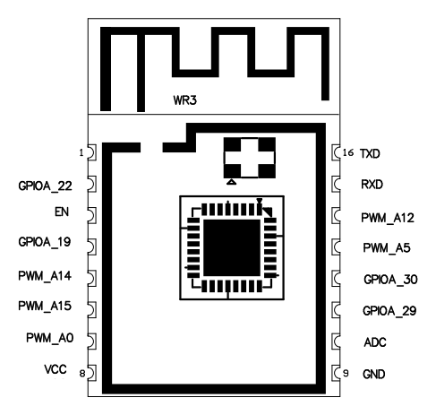

# WR3 Wi-Fi Module

[Product page](https://developer.tuya.com/en/docs/iot/wifiwr1module?id=K9605tc0k90t3)

- [Debugging](../../docs/platform/realtek/Debugging.md)

Parameter    | Value
-------------|-------------------------
MCU          | RTL8710BN
Manufacturer | Realtek
Series       | AmebaZ
Max. clock   | 125 MHz
Flash size   | 2 MiB
RAM size     | 256 KiB
Voltage      | 3.0V - 3.6V
I/O          | 7x GPIO, 2x UART, 1x ADC
Wi-Fi        | 802.11 b/g/n

## Pinout

## Arduino core pin map

No. | Pin   | Alt. function | PWM
----|-------|---------------|-----
D0  | PA_22 |               | PWM5
D1  | PA_19 |               |
D2  | PA_14 | SWCLK         | PWM0
D3  | PA_15 | SWDAT         | PWM1
D4  | PA_0  |               | PWM2
D5  | PA_20 |               |
D6  | PA_29 | UART_Log_RXD  | PWM4
D7  | PA_30 | UART_Log_TXD  | PWM3
D8  | PA_5  |               | PWM4
D9  | PA_12 |               | PWM3
D10 | PA_18 | UART0_RXD     |
D11 | PA_23 | UART0_TXD     | PWM0
A0  | PA_19 |               |
A1  | -     |               |
A2  | PA_20 |               |

## Flash memory map

Flash size: 2 MiB / 2,097,152 B / 0x200000

Hex values are in bytes.

Name        | Start    | Length            | End
------------|----------|-------------------|---------
Boot XIP    | 0x000000 | 16 KiB / 0x4000   | 0x004000
Boot RAM    | 0x004000 | 16 KiB / 0x4000   | 0x008000
(reserved)  | 0x008000 | 4 KiB / 0x1000    | 0x009000
System Data | 0x009000 | 4 KiB / 0x1000    | 0x00A000
Calibration | 0x00A000 | 4 KiB / 0x1000    | 0x00B000
OTA1 Image  | 0x00B000 | 788 KiB / 0xC5000 | 0x0D0000
OTA2 Image  | 0x0D0000 | 788 KiB / 0xC5000 | 0x195000
User Data   | 0x195000 | 424 KiB / 0x6A000 | 0x1FF000
RDP         | 0x1FF000 | 4 KiB / 0x1000    | 0x200000

RDP is most likely not used in Tuya firmwares, as the System Data partition contains
an incorrect offset 0xFF000 for RDP, which is in the middle of OTA2 image.

Additionally, Tuya firmware uses an encrypted KV or file storage, which resides at the end of flash memory. This seems to overlap system RDP area.
