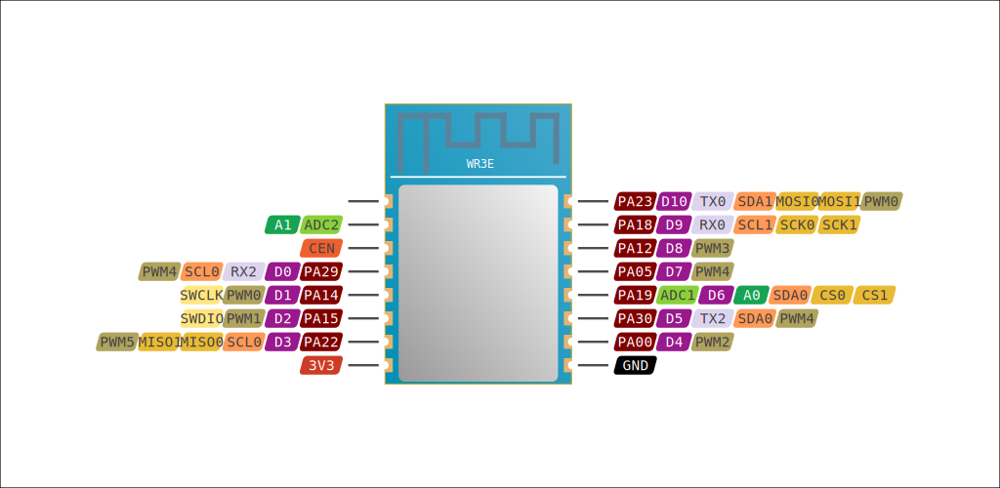

# WR3E Wi-Fi Module

*by Tuya Inc.*

[Product page](https://developer.tuya.com/en/docs/iot/wr3e-module-datasheet?id=K9elwlqbfosbc)

- [General info](../../docs/platform/realtek/README.md)
- [Debugging](../../docs/platform/realtek/debugging.md)
- [Flashing guide](../../docs/platform/realtek-ambz/flashing.md)
- [ImageTool (AmebaZ/AmebaD)](https://images.tuyacn.com/smart/Image_Tool/Image_Tool.zip)

Parameter    | Value
-------------|------------------------------------------
Board code   | `wr3e`
MCU          | RTL8710BN
Manufacturer | Realtek
Series       | AmebaZ
Frequency    | 125 MHz
Flash size   | 2 MiB
RAM size     | 256 KiB
Voltage      | 3.0V - 3.6V
I/O          | 11x GPIO, 6x PWM, 2x UART, 2x ADC
Wi-Fi        | 802.11 b/g/n
FCC ID       | [2ANDL-WR3E](https://fccid.io/2ANDL-WR3E)

## Usage

**Board code:** `wr3e`

In `platformio.ini`:

```ini
[env:wr3e]
platform = libretuya
board = wr3e
framework = arduino
```

## Pinout



## Arduino Core pin mapping

No. | Pin        | UART      | I²C      | SPI                  | PWM  | Other
----|------------|-----------|----------|----------------------|------|------
D0  | PA29       | UART2_RX  | I2C0_SCL |                      | PWM4 |
D1  | PA14       |           |          |                      | PWM0 | SWCLK
D2  | PA15       |           |          |                      | PWM1 | SWDIO
D3  | PA22       | UART0_RTS | I2C0_SCL | SPI0_MISO, SPI1_MISO | PWM5 |
D4  | PA00       |           |          |                      | PWM2 |
D5  | PA30       | UART2_TX  | I2C0_SDA |                      | PWM4 |
D6  | PA19       | UART0_CTS | I2C0_SDA | SPI0_CS, SPI1_CS     |      |
D7  | PA05       |           |          |                      | PWM4 |
D8  | PA12       |           |          |                      | PWM3 |
D9  | PA18       | UART0_RX  | I2C1_SCL | SPI0_SCK, SPI1_SCK   |      |
D10 | PA23       | UART0_TX  | I2C1_SDA | SPI0_MOSI, SPI1_MOSI | PWM0 |
A0  | PA19, ADC1 |           |          |                      |      |
A1  | ADC2       |           |          |                      |      |

## Flash memory map

Flash size: 2 MiB / 2,097,152 B / 0x200000

Hex values are in bytes.

Name            | Start    | Length            | End
----------------|----------|-------------------|---------
Boot XIP        | 0x000000 | 16 KiB / 0x4000   | 0x004000
Boot RAM        | 0x004000 | 16 KiB / 0x4000   | 0x008000
(reserved)      | 0x008000 | 4 KiB / 0x1000    | 0x009000
System Data     | 0x009000 | 4 KiB / 0x1000    | 0x00A000
Calibration     | 0x00A000 | 4 KiB / 0x1000    | 0x00B000
OTA1 Image      | 0x00B000 | 788 KiB / 0xC5000 | 0x0D0000
OTA2 Image      | 0x0D0000 | 788 KiB / 0xC5000 | 0x195000
Key-Value Store | 0x195000 | 24 KiB / 0x6000   | 0x19B000
User Data       | 0x19B000 | 400 KiB / 0x64000 | 0x1FF000
RDP             | 0x1FF000 | 4 KiB / 0x1000    | 0x200000

RDP is most likely not used in Tuya firmwares, as the System Data partition contains an incorrect offset 0xFF000 for RDP, which is in the middle of OTA2 image.

Additionally, Tuya firmware uses an encrypted KV or file storage, which resides at the end of flash memory. This seems to overlap system RDP area.
